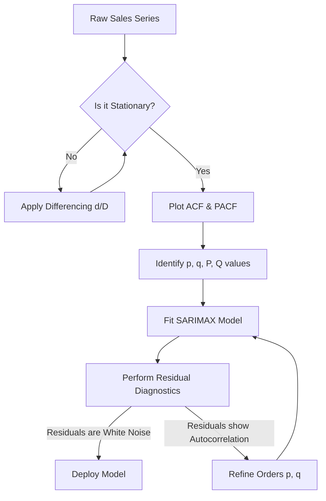

# 📊 Advanced Guide: Statistical Modelling & Business Forecasting Prep

This guide is specifically designed to help you ace your upcoming rounds. It addresses your interview feedback by providing **deep technical defenses of statistical models**, **concrete business linkages**, and **strategic answers for HR/CTC/relocation questions**.

---

## 🗺️ Part 1: HR, CTC, and Relocation Strategy (The Positive Signals)

Asking about **relocation to Hyderabad**, **expected CTC**, and describing **the team being formed** are strong indicators that you cleared the initial screening baseline. Recruiters rarely discuss budget and relocation unless they see potential. Here is how to handle these questions in the next rounds.

### 1. Relocation to Hyderabad
*   **The Strategy:** Show enthusiasm, flexibility, and stability. You want to convey that relocating is a positive career step, not a hurdle.
*   **Model Answer:**
    > *"I am highly enthusiastic about relocating to Hyderabad. It is a major technology hub with a thriving data science community, and I see it as the ideal place to grow my career. Personally, I have no constraints and am fully prepared to relocate as soon as the onboarding process requires. I’m excited about the opportunity to work closely with the team in person."*

### 2. Expected CTC (Compensation)
*   **The Strategy:** Avoid anchoring with a single hard number too early, which can either price you out or leave money on the table. Instead, state a professional, market-aligned range and emphasize that you are open to negotiation based on the complete compensation structure (base, performance bonuses, benefits).
*   **Model Answer:**
    > *"Based on my experience in time series forecasting, machine learning engineering, and building end-to-end ML pipelines, I am looking for a compensation that aligns with market standards for this role. I expect something in the range of `[Insert Your Range, e.g., 8 to 12 LPA]` fixed component. However, my primary focus is on the impact of the role and the team being formed, and I am highly open to a fair discussion once we align on the responsibilities and the complete benefits package."*

### 3. Show Interest in the "Team Being Formed"
*   **The Strategy:** Use this information to stand out. Ask intelligent questions about this new team. It shows that you think like a partner, not just an applicant.
*   **Questions to Ask the Interviewer:**
    1. *"You mentioned a new team is being formed. What are the immediate high-priority forecasting or modeling problems this team is tasked with solving in the first 6 months?"*
    2. *"Will the team be focusing purely on classical statistical forecasting (like demand planning/supply chain), or will we be integrating deep learning and real-time streaming ML pipelines?"*
    3. *"What does the collaboration look like between the data science team and the engineering/ops teams in Hyderabad?"*

---

## 📈 Part 2: Defending Statistical Modelling & Forecasting Projects

Classical statistical models (ARIMA, SARIMA, ETS) are heavily favored in industry because they are **explainable, mathematically rigorous, and handle uncertainty (confidence intervals) exceptionally well**. Here is how to defend them like an expert.



### 1. The Core Assumptions of Classical Forecasting Models
If you tell an interviewer you used ARIMA, they will immediately ask: **"What are the mathematical assumptions you made?"**

*   **Assumption 1: Stationarity.** The series must have a constant mean, constant variance, and autocovariance that does not depend on time.
    *   *Defense:* "We cannot reliably estimate parameters if the statistical properties change over time. I check stationarity using the **Augmented Dickey-Fuller (ADF) test**. If the p-value is $>0.05$, the series is non-stationary, and I apply first-order differencing ($d=1$) or seasonal differencing ($D=1$)."
*   **Assumption 2: Linearity.** ARIMA assumes the relationship between past values and current values is linear.
    *   *Defense:* "While ARIMA assumes linearity, if there are non-linearities, I either transform the target (e.g., using Log or Box-Cox transforms to stabilize variance) or supplement it with a non-linear model like XGBoost."
*   **Assumption 3: Independent and Identically Distributed (IID) Residuals (White Noise).** Once the model fits, the errors (residuals) should contain zero information.
    *   *Defense:* "The residuals must have a mean of zero, constant variance (homoscedasticity), and zero autocorrelation. I verify this by plotting the residuals and running the **Ljung-Box test** on the residuals. If the test returns a p-value $>0.05$, we fail to reject the null hypothesis of white noise, confirming the model has captured all temporal information."

### 2. Reading ACF and PACF Plots to Select Orders (p, d, q)
Don't just say you ran `auto_arima`. Explain how you analyze autocorrelation.

*   **ACF (Autocorrelation Function):** Measures the correlation between the series and its lags, including both direct and indirect effects.
*   **PACF (Partial Autocorrelation Function):** Measures the correlation between the series and its lags *after removing* the effects of intermediate lags.

| Process Type | ACF Plot Behavior | PACF Plot Behavior |
| :--- | :--- | :--- |
| **AR(p)** (Auto-Regressive) | Decays exponentially or as a damped sine wave | Cuts off abruptly after lag $p$ |
| **MA(q)** (Moving Average) | Cuts off abruptly after lag $q$ | Decays exponentially or as a damped sine wave |
| **ARMA(p, q)** | Decays exponentially | Decays exponentially |

*   **How you explain your order `(5, 1, 2)`:**
    > *"In our retail forecasting project, I ran the ADF test on the raw sales and found a strong trend, indicating non-stationarity ($p\text{-value} > 0.05$). Applying first-order differencing ($d=1$) stabilized the mean, rendering the series stationary ($p\text{-value} < 0.01$). Looking at the PACF of the differenced series, we saw significant spikes up to lag 5, suggesting an AR component of $p=5$. The ACF showed significant spikes up to lag 2 before tapering off, suggesting an MA component of $q=2$. This gave us our baseline ARIMA(5, 1, 2) configuration."*

---

## 💼 Part 3: Linking Your Project to Real-World Business Value

An "average" interview performance is often due to describing **what** you did technically without explaining **why** it matters to a business. Here is how to link your forecasting project to actual business outcomes.

### The Business Case: Inventory Optimization and Safety Stock
In retail, a forecast is not just a chart; it dictates **money**.

```
    [Low Accuracy Forecast]
      /               \
     v                 v
[Under-Forecast]     [Over-Forecast]
  (Stockouts)         (Excess Inventory)
  - Lost Revenue      - Capital Tied Up
  - Poor Service      - Holding Costs (20-30%/yr)
  - Churned Clients   - Margins Hit by Discounts
```

*   **How to explain the business impact of your forecast accuracy:**
    > *"A forecast's primary job in retail is to balance the cost of **carrying inventory** against the cost of **stockouts (lost sales)**. If we under-forecast, we run out of stock, lose revenue, and degrade customer trust. If we over-forecast, we tie up working capital in warehouses, incur holding costs (which average 20-30% of the inventory value annually), and are forced to run margin-damaging markdowns later."*

*   **Linking RMSE to safety stock calculations (The Math that Wins Interviews):**
    > *"We link our model's validation error directly to inventory calculations. Safety stock is calculated using the formula:*
    > $$Safety\ Stock = Z \times \sqrt{Lead\ Time} \times \sigma_{forecast\_error}$$
    > *Where $Z$ is the service factor (e.g., $1.65$ for a 95% service level), and $\sigma_{forecast\_error}$ is the standard deviation of our forecast error, which is directly approximated by the **Root Mean Squared Error (RMSE)** of our validation set.*
    > *By improving our model's RMSE (for instance, using Prophet or XGBoost over a naive average), we reduce the uncertainty $\sigma_{forecast\_error}$. This allows the retail store to **lower their safety stock requirements by 10-15%** while maintaining the exact same 95% customer service level, directly freeing up working capital that was previously locked in warehouse shelves."*

---

## ❓ Part 4: Top 10 Hard Statistical & Forecasting Questions (With Answers)

### Q1: "Why use classical models like ARIMA or Prophet when you could just throw XGBoost or an LSTM at the problem?"
> *"Classical statistical models have three main advantages over machine learning for time series:*
> 1.  ***Data Efficiency:** ARIMA requires very little data to fit stable parameters (as few as 50-100 historical points). XGBoost and LSTMs need thousands of data points to learn temporal patterns without overfitting.*
> 2.  ***Uncertainty Quantification:** ARIMA and Prophet generate mathematically rigorous prediction intervals (confidence bands) based on residual variance. XGBoost does not naturally output intervals unless you use quantile loss.*
> 3.  ***Interpretability:** In Prophet, the forecast is explicitly decomposed into Trend, Weekly Seasonality, Yearly Seasonality, and Holidays. A business user can see exactly why a prediction is high (e.g., 'It's a Saturday during Christmas week'). XGBoost is a black box where features like lag-lags must be explained via SHAP values, which is harder for operations teams to trust."*

### Q2: "What is the difference between additive and multiplicative seasonality? How do you determine which to use?"
*   **Additive Seasonality:** The seasonal fluctuations are constant in magnitude regardless of the trend level ($Y_t = Trend + Seasonality + Noise$).
*   **Multiplicative Seasonality:** The seasonal fluctuations increase or decrease in proportion to the trend ($Y_t = Trend \times Seasonality \times Noise$).
*   *How to decide:*
    > *"I plot the time series and look at the seasonal spikes as the trend rises. If the peak-to-trough distance remains relatively constant as sales grow, I use additive seasonality. If the seasonal swings expand proportionally with the overall trend, I use multiplicative seasonality. In our code, Prophet handles this via the `seasonality_mode` parameter, which we set based on EDA visual inspections."*

### Q3: "What is the Ljung-Box test, and what does it tell you?"
> *"The Ljung-Box test is a diagnostic tool used to check if the residuals of a fitted time series model have any remaining autocorrelation. The null hypothesis ($H_0$) is that the residuals are independently distributed (i.e., they are white noise). The alternative hypothesis ($H_a$) is that the residuals exhibit serial correlation.*
> *If the test returns a p-value $< 0.05$, we reject $H_0$, meaning our model residuals still contain patterns that our model failed to capture. In that case, we need to adjust the ARIMA orders (e.g., increase $p$ or $q$) or add seasonal parameters."*

### Q4: "How do you handle structural breaks or sudden level shifts (like COVID-19 lockdowns) in statistical models?"
> *"Classical ARIMA is highly sensitive to structural breaks because it assumes a stationary process. To handle sudden level shifts, I employ three techniques:*
> 1.  ***Intervention Analysis / Dummy Variables:** Introduce binary exogenous regressor variables ($X$) in a SARIMAX framework (e.g., $1$ during the lockdown period, $0$ otherwise) to allow the model to adjust the intercept dynamically.*
> 2.  ***Prophet Changepoints:** Prophet allows us to specify explicit changepoints where the growth rate can change. We can manually add a changepoint on the date of the shift or adjust the `changepoint_prior_scale` to let the model fit the shift more aggressively.*
> 3.  ***Windowing:** If the market dynamics shifted permanently, I discard history prior to the break and train the model only on the post-break regime to prevent old data from biasing future forecasts."*

### Q5: "What is the difference between SARIMA and SARIMAX? When would you use the 'X'?"
> *"The 'X' in SARIMAX stands for **eXogenous variables**. While SARIMA models the forecast purely based on past values of the target series itself (endogenous variables), SARIMAX allows us to feed in external time-dependent variables that correlate with the target.*
> *In retail forecasting, I use the 'X' to include:*
> *   *Promotional flags (binary: 1 if promo is active, 0 otherwise)*
> *   *Pricing changes or discount percentages*
> *   *Competitor pricing data*
> *   *Local weather metrics (e.g., temperature affects outdoor apparel sales)*
> *   *Macroeconomic indicators (e.g., CPI or regional holidays)*
> *The model fits a linear coefficient to these exogenous features and models the remaining residuals using the SARIMA process."*

### Q6: "What is the difference between standard differencing ($d$) and seasonal differencing ($D$)?"
> *"Standard differencing ($d$) is used to remove a trend and stabilize the mean by subtracting consecutive observations: $Y'_t = Y_t - Y_{t-1}$. This is effective for removing a linear upward or downward drift.*
> *Seasonal differencing ($D$) is used to eliminate seasonal patterns by subtracting observations from the same season in the previous cycle: $Y'_t = Y_t - Y_{t-s}$, where $s$ is the seasonal period (e.g., $s=7$ for daily data with weekly patterns, or $s=12$ for monthly data with yearly patterns).*
> *If a series has both trend and seasonality, we apply both standard and seasonal differencing to make the series stationary."*

### Q7: "What is the Granger Causality test? How is it useful in forecasting?"
> *"The Granger Causality test is a statistical hypothesis test to determine whether one time series is useful in forecasting another. A variable $X$ is said to 'Granger-cause' $Y$ if providing historical values of $X$ yields statistically significantly better forecasts of $Y$ than using historical values of $Y$ alone.*
> *In retail, I run Granger Causality tests before adding exogenous variables to a SARIMAX or VAR (Vector Autoregression) model. For example, I might test whether 'marketing spend' Granger-causes 'website traffic' with a lag of 3 days. This ensures we only include features that have predictive, leading-indicator value."*

### Q8: "How do you evaluate a model if the target variable has zero-inflated or highly intermittent demand (e.g., spare parts sales)?"
> *"Classical statistical models like ARIMA perform poorly on intermittent demand because they assume continuous distributions. If sales are zero-inflated, I use specialized approaches:*
> 1.  ***Croston’s Method:** This statistical method separately models the non-zero demand size (using exponential smoothing) and the time interval between demand occurrences. It is the industry standard for spare parts forecasting.*
> 2.  ***Metrics:** Traditional metrics like MAPE break down when actual values are zero (division by zero). Instead, I use **WAPE (Weighted Absolute Percentage Error)** or **MASE (Mean Absolute Scaled Error)**, which are robust to zero values."*

### Q9: "Why is MASE (Mean Absolute Scaled Error) highly recommended for comparing models across different time series?"
> *"MAPE has major drawbacks: it is infinite or undefined for zero values, and it penalizes negative errors more than positive errors. MASE solves this by scaling the Mean Absolute Error (MAE) of our forecast against the MAE of a simple, in-sample one-step naive baseline forecast:*
> $$MASE = \frac{MAE}{MAE_{naive}}$$
> *A MASE value $< 1$ means our model performs better than a naive baseline (predicting the previous value). A MASE $> 1$ means the model is worse than the naive baseline. Because it is scaled, MASE allows us to compare model performance across completely different products (e.g., high-volume vs. low-volume items) on a fair, standardized scale."*

### Q10: "Explain the bias-variance tradeoff in the context of choosing a time series forecasting window."
> *"The bias-variance tradeoff applies directly to how much historical data we use for training:*
> *   ***Long training window (e.g., 5+ years of data):** Low variance (more data stabilizes parameter estimations), but high bias if the market dynamics, customer behavior, or store footprint changed significantly over those years (the model tries to fit outdated patterns).*
> *   ***Short training window (e.g., last 6 months):** Low bias (the model adapts quickly to recent customer trends and current economic conditions), but high variance (parameters can easily overfit to temporary noise, short-term promotions, or unusual weather).*
> *To find the optimal balance, I perform **walk-forward validation** across different historical window lengths and choose the one that minimizes out-of-sample RMSE."*

---

## 🎯 Quick Check: Your Live Dashboard & Project Files
You can reference these files during the interview to prove you wrote modular, high-quality code:

*   **Model Definitions:** [arima_model.py](file:///c:/ML_Project/Time%20Series/retail-sales-forecasting/src/models/arima_model.py) shows the implementation of ARIMA and SARIMAX.
*   **Stationarity & Evaluation Logic:** [preprocessing.py](file:///c:/ML_Project/Time%20Series/retail-sales-forecasting/src/preprocessing.py) shows how missing days are filled and how series are scaled chronologically.
*   **Configuration Settings:** [config.py](file:///c:/ML_Project/Time%20Series/retail-sales-forecasting/src/config.py) lists the orders: `ARIMA_ORDER = (5, 1, 2)` and `SARIMA_SEASONAL = (1, 1, 1, 7)`.
